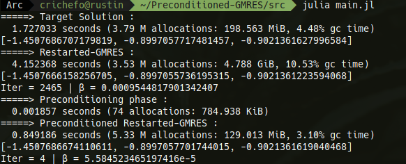

# Preconditioned-GMRES
Here is stored different preconditioning routines for the GMRES algorithm such as ILU(0), ILU(k) or ILU(t,p).

Incomplete LU like algorithms are perfectly well explained in <i>Iterative Methods for Sparse Linear Systems</i> p. 321 written by <i>Youssef Saad</i>, and I recommand to read the relative chapter (named <i>Preconditioning Techniques</i>) for a good understanding of how these approaches work.

Everything has been developed by my own but (obviously) routines imported from <a href=https://docs.julialang.org/en/v1/stdlib/SparseArrays/index.html>SparseArrays</a> and <a href=https://docs.julialang.org/en/v1/stdlib/LinearAlgebra/>LinearAlgebra</a>.

Feel free to use and comment on my work! :-)

## Prerequisites
* Julia
* SparseArrays.jl
* LinearAlgebra.jl

## Running the code

```shell
julia sparse_gmres.jl
```
By default, the code is ran on an Harwel-Boeing matrix <i>orsirr_1.mtx</i>.

I discussed with the Professor <i>Serge G. Petiton</i> and he adviced me to use the <a href=https://smg2s.github.io/>Parallel Generator of Non-Hermitian Matrices Computed from Given Spectra</a> he developed himself with <i><a href=https://github.com/brunowu>Xinzhe Wu<a></i>. This can be a very useful tool for benchmarking GMRES and Preconditioners given a set of eigenvalues, and will be called soon. 

## Output 
<p align='center'>

</p>

Output returns performances of :
* Direct solver method x = A\b
* Restarted GMRES without preconditioning
* Restarted GMRES with ILU(t,p) preconditioning (but other preconditioners can be chosen)

<i>We can see here that accuracy has been degraded in the Preconditined GMRES because of the threshold chosen. Smaller will be the threshold and bigger will be the integer p, more accurate should be the final solution but slower in computation time and heavier in memory.</i>

## In coming ...

* Use a threshold strategy for the sparse_solve_matrix_ut/lt (<a href=src/sparse_solvers.jl>sparse_solvers.jl</a>) in order to reduce computation time by droping the smallest non-zero entries according to the given threshold. However, such an approach would degrade the accuracy of the final solution x computed iteratively by GMRES
* Implement Hybrid Incomplete LU factorization
* Implement parallelism for ILU routines described in the chapter called <i>Parallel Preconditioners</i> of the book <i>Iterative Methods for Sparse Linear Systems</i>.
